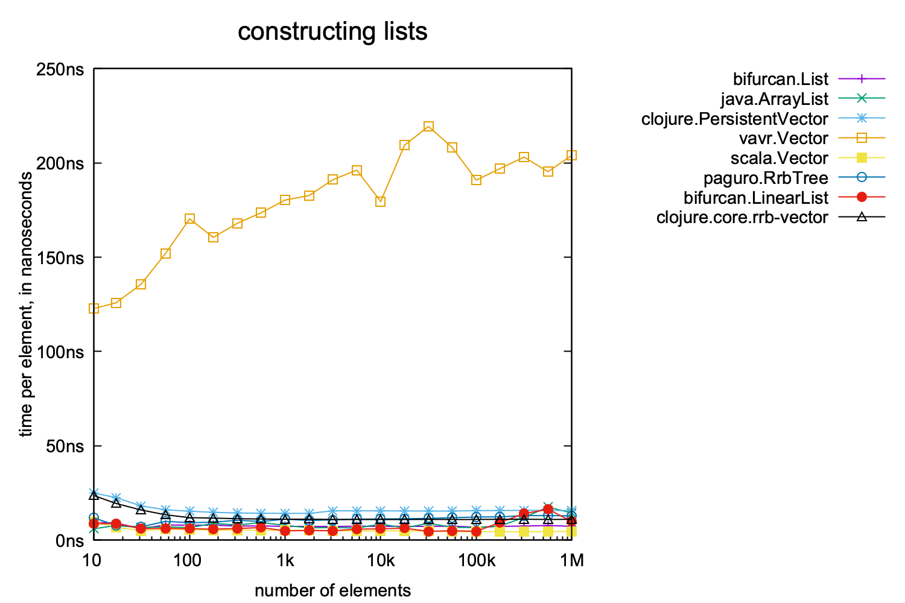
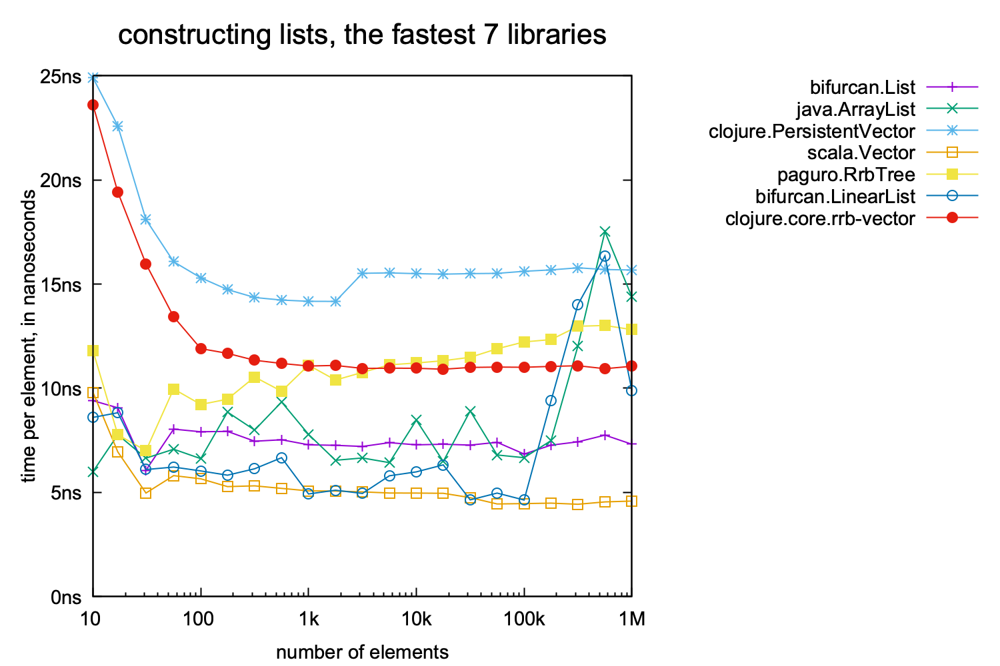
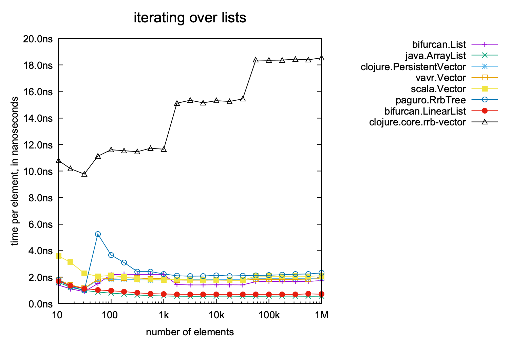
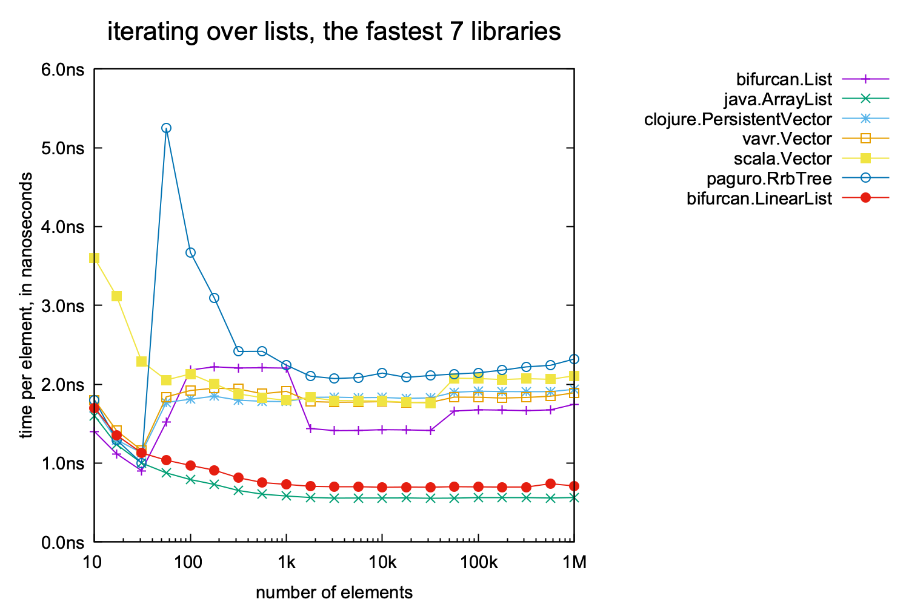
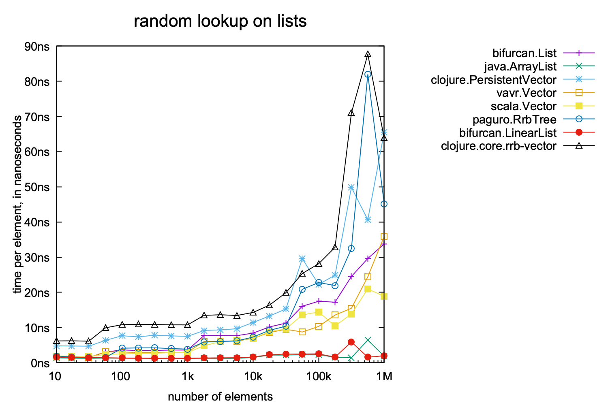
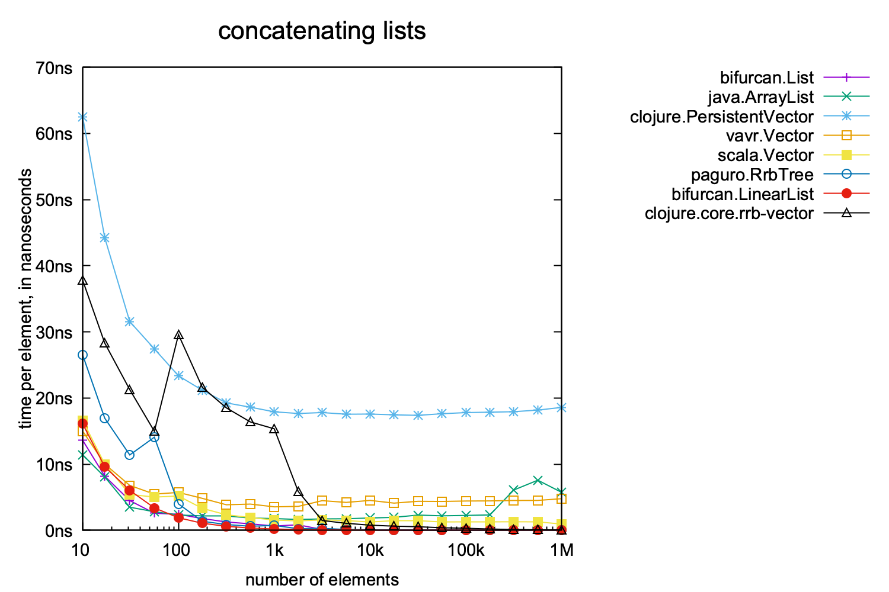
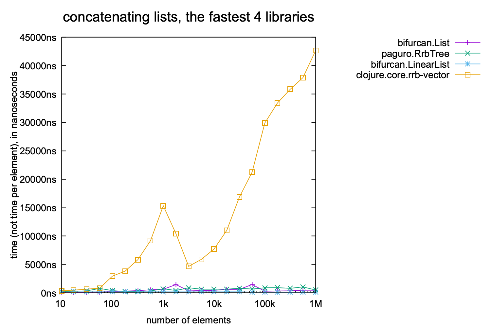
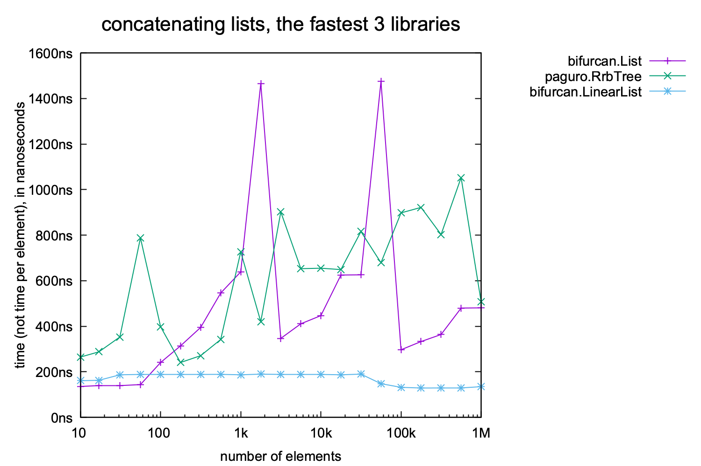

# core.rrb-vector benchmarks

See the section "How the benchmarks were run" below for how the
results were created.


## Benchmark results

These benchmark results are based upon benchmark code written for the
[`bifurcan`](https://github.com/lacuna/bifurcan) library.  The
[benchmarks published originally
here](https://github.com/lacuna/bifurcan/blob/master/doc/comparison.md)
include comparisons of data structures other than vectors, e.g. hash
maps and sorted sets.

Note that for the data structures we care most about here, those
results call them "lists" rather than "vectors".  I will use "lists"
here to be consistent with the `bifurcan` benchmarks.  The portion of
the `bifurcan` results relevant to lists can be found
[here](https://github.com/lacuna/bifurcan/blob/master/doc/comparison.md#lists).

The time measurements here were made on a different machine than the
`bifurcan` results, so you should not infer anything from the absolute
time measurements here vs. there.  Only the relative time measurements
between the libraries in one set of benchmark results.

---



As in the original benchmark results, construction times are quite
consistent (at the scale shown in this graph) across different
libraries, except for vavr.  The graph below shows the results for all
libraries except vavr, so that any differences between them become
more apparent.  Even at that finer scale the maximum differences above
100 element vectors appears to be at most 3x.



---



Without core.rrb-vector included, Zach Tellman's original comment on
these results was "The mutable collections, which are stored
contiguously, are only moderately faster than their immutable
counterparts".

core.rrb-vector is significantly slower, for reasons I have yet to
investigate.  The reason for the increases near 1K elements and 32K
elements are most likely because those are the sizes where the 32-way
tree data structure gets one level deeper.

The graph below shows the results for all except the core.rrb-vector
library, so any differences between those libraries can be seen.
Several of them show at least some change in run time when crossing
the 1K and 32K element points.



---



Zach's comment on the original results, which are nearly identical to
those shown above: "The mutable collections are O(1) while their
immutable counterparts are unmistakably O(log N)."

---



Zach's comment on the original results: "Concatenation is O(N) for
every library except Paguro and Bifurcan, which are O(log N) due to
their use of RRB trees."

I know for a fact that clojure.PersistentVector does not use RRB
trees, and concatenation takes at least linear time (multiplied by
some small log factor) in the length of the second vector.  This
appears to be the case for vavr.Vector and java.ArrayList as well.

I would have guessed that scala.Vector used RRB trees as well, but
have not checked the implementation yet to verify.  If it does use RRB
trees, it is by far the slowest of the ones that do, at least for
vectors 100K in size and larger -- perhaps the scala.Vector authors
chose to implement some more extensive tree rebalancing than other RRB
implementers did, in order to preserve faster run times for other
operations?

The next graph shows the results with only the 4 libraries that are
the fastest for concatenation.  Unlike the previous graphs, the
vertical axis is the elapsed time, not "elapsed time per vector
element".  RRB trees should enable O(log N) run time for
concatenation.

core.rrb-vector is the slowest of these by a large factor, probably
because of a concatenation implementation that has not been
scrutinized for optimization opportunities yet.



The next graph shows only the 3 libraries that are the fastest for
concatenation, to see any detail that might be of interest there.
Like the previous one, the vertical axis is elapsed time, not elapsed
time per vector element.

TBD: How can bifurcan.LinearList have pretty much a constant run time
for all vector sizes?



---


## How the benchmarks were run

To run benchmarks from the Bifurcan project, with small modifications
that add core.rrb-vector to the list of libraries that are measured,
follow these steps.  Note that the version of the `bifurcan.List` data
structure code used in these results has a few proposed bug fixes from
the version of the code in the original `bifurcan` repository, but I
do not believe they affect the performance in any noticeable way.

```bash
$ git clone https://github.com/jafingerhut/bifurcan
$ cd bifurcan
$ git checkout 457fd0346b78392f39e4c0e79f1e43b7847ea93b
$ ./benchmarks/run-vectors-only.sh
```

To copy the data and images produced as a result of the above, to
where I copied them in this repository:

```bash
$ DST=/path/to/my/clone/of/core.rrb-vector/doc/benchmarks
$ mkdir $DST/images $DST/data
$ cp -p benchmarks/images/list*.png benchmarks/images/concat*.png $DST/images
$ cp -p benchmarks/data/benchmarks.edn benchmarks/data/concat.csv benchmarks/data/list*.csv $DST/data
```

The benchmark results here were measured on a system with these
properties:

* MacBook Pro model 11,2, 2.5 GHz Intel Core i7 with peak clock speed
  3.6 GHz, 16 GB RAM
* macOS 10.14.6
* AdoptOpenJDK 11.0.4, 64-bit server build 11.0.4+11
* Leiningen 2.9.1
* To see the versions of the list libraries that were measured, look
  in the project.clj file of the bifurcan project at the commit
  mentioned above.  For core.rrb-vector, the only measured library
  that is written in Clojure, that project.clj file currently
  specifies Clojure version 1.8.0.  The other libraries are written in
  Java.
